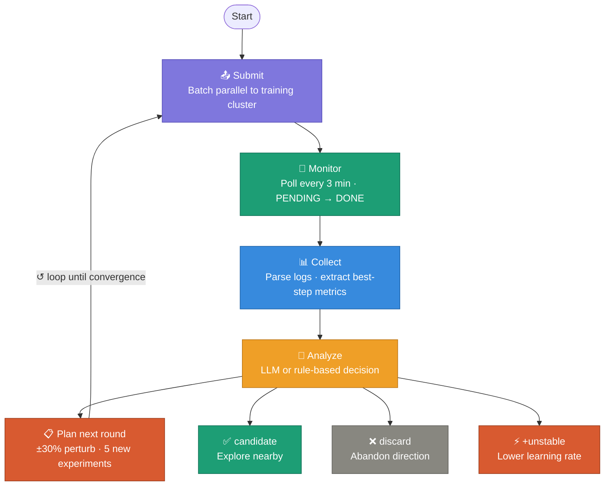
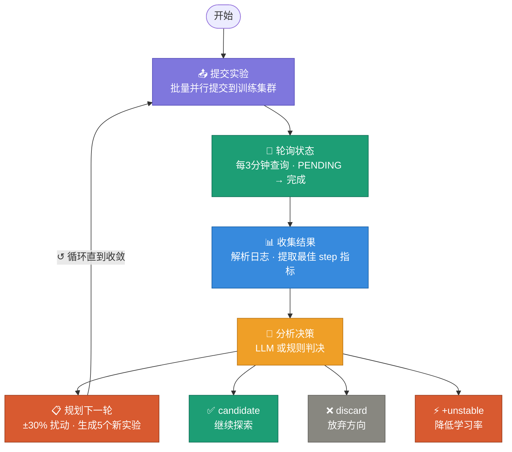

<div align="center">

# autorl-loop

**Universal AutoRL Hyperparameter Search Framework**

*LLM-driven · Platform-agnostic · Zero human intervention*

[](LICENSE)
[](https://python.org)

[English](#english) | [中文](#中文)

</div>

---

<a name="english"></a>
## English

### Overview

`autorl-loop` automates the full RL hyperparameter search cycle. You define your training script, parameter space, and baseline — the framework does the rest.



### Quickstart

```bash
pip install autorl-loop
pip install "autorl-loop[llm]"       # for LLM-driven search

cp examples/minimal/autorl_config.yaml .
autorl init                           # submit initial experiments
nohup autorl run &                    # start autonomous loop
autorl status                         # check progress
```

### Configuration

```yaml
experiment:
  baseline: 0.80        # accuracy to beat
  noise_floor: 0.005    # min improvement to count as "candidate"

parameters:
  actor_lr:
    default: 5e-5
    type: float
    range: [1e-6, 1e-3]
  ppo_epochs:
    default: 4
    type: int
    range: [1, 8]

backend:
  type: cloudml         # cloudml / slurm / local

search:
  strategy: llm         # perturbation / llm
  experiments_per_round: 5
  max_rounds: 20
```

### Platform Support

| Platform | Backend | Notes |
|----------|---------|-------|
| Local | `local` | Sequential or parallel |
| Slurm | `slurm` | Via `sbatch` / `squeue` / `sacct` |
| CloudML | `cloudml` | Via `cml` CLI |
| Custom | `BaseBackend` | Implement 3 methods |

### Search Strategies

| Strategy | How it works | Best for |
|----------|-------------|----------|
| `perturbation` | ±30% random perturbation of best config | Fast & reliable |
| `llm` | LLM analyzes results, suggests next params | Complex param interactions |

### Decision Logic

| Label | Meaning | Next action |
|-------|---------|-------------|
| `candidate` | delta > noise_floor, stable | Explore nearby |
| `marginal` | Small improvement | Follow cautiously |
| `neutral` | No change | Ignore |
| `discard` | Worse than baseline | Abandon direction |
| `+unstable` | grad_norm > 15 | Lower learning rate |

### Extending

**Custom backend:**
```python
from autorl.backends.base import BaseBackend

class MyBackend(BaseBackend):
    def submit(self, exp) -> str:
    def get_status(self, job_id) -> str:   # PENDING/RUNNING/SUCCEED/FAILED
    def generate_script(self, exp, dir) -> str:
```

**Custom log parser:**
```python
from autorl.parsers.base import BaseLogParser

class MyParser(BaseLogParser):
    def extract_metrics(self, exp) -> dict:
        return {"best_acc": 0.95, "best_step": 150}
```

### Project Structure

```
autorl-loop/
├── autorl/
│   ├── core/
│   │   ├── experiment.py    # Experiment dataclass
│   │   ├── runner.py        # Main loop orchestrator
│   │   └── tracker.py       # TSV result persistence
│   ├── backends/
│   │   ├── cloudml.py       # CloudML platform
│   │   ├── slurm.py         # Slurm HPC clusters
│   │   └── local.py         # Local execution
│   ├── search/
│   │   ├── perturbation.py  # ±30% perturbation
│   │   └── llm.py           # LLM-driven search
│   ├── parsers/
│   │   └── verl.py          # verl framework parser
│   └── cli.py               # autorl CLI
├── examples/
│   ├── verl_cloudml/        # verl + CloudML example
│   └── minimal/             # minimal local example
└── pyproject.toml
```

---

<a name="中文"></a>
## 中文

### 简介

`autorl-loop` 是一个**通用的强化学习超参数自动搜索框架**，支持 LLM 驱动的智能决策。你只需定义训练脚本、参数空间和基线指标，框架自动完成其余所有工作，全程无需人工干预。



### 快速开始

```bash
pip install autorl-loop
pip install "autorl-loop[llm]"       # LLM 智能搜索

cp examples/minimal/autorl_config.yaml .
autorl init                           # 提交初始实验
nohup autorl run &                    # 启动全自动循环
autorl status                         # 查看进度
```

### 配置文件

```yaml
experiment:
  baseline: 0.9411      # 需要超越的基线指标
  noise_floor: 0.001    # 最小有效提升

parameters:
  actor_lr:
    default: 5e-5
    type: float
    range: [1e-6, 1e-3]
  ppo_epochs:
    default: 4
    type: int
    range: [1, 8]

backend:
  type: cloudml         # cloudml / slurm / local

search:
  strategy: llm         # perturbation / llm
  experiments_per_round: 5
  max_rounds: 20
```

### 平台支持

| 平台 | 后端 | 说明 |
|------|------|------|
| 本地 | `local` | 顺序或并行执行 |
| Slurm | `slurm` | 通过 `sbatch` / `squeue` |
| CloudML | `cloudml` | 通过 `cml` CLI |
| 自定义 | `BaseBackend` | 实现3个方法即可接入任意平台 |

### 搜索策略

| 策略 | 原理 | 适用场景 |
|------|------|---------|
| `perturbation` | 在最优配置上随机 ±30% 扰动 | 快速可靠 |
| `llm` | LLM 分析全量结果，推断下一轮参数 | 参数之间有复杂交互 |

### 判决逻辑

| 标签 | 含义 | 下一步动作 |
|------|------|-----------|
| `candidate` | 超出基线 > noise_floor 且稳定 | 继续在此方向探索 |
| `marginal` | 小幅提升 | 谨慎跟进 |
| `neutral` | 无变化 | 忽略 |
| `discard` | 低于基线 | 放弃此方向 |
| `+unstable` | 梯度范数 > 15 | 降低学习率重试 |

### 扩展接口

**自定义训练平台后端：**
```python
from autorl.backends.base import BaseBackend

class MyBackend(BaseBackend):
    def submit(self, exp) -> str:
    def get_status(self, job_id) -> str:   # PENDING/RUNNING/SUCCEED/FAILED
    def generate_script(self, exp, dir) -> str:
```

**自定义日志解析器：**
```python
from autorl.parsers.base import BaseLogParser

class MyParser(BaseLogParser):
    def extract_metrics(self, exp) -> dict:
        return {"best_acc": 0.95, "best_step": 150}
```

---

## License

MIT